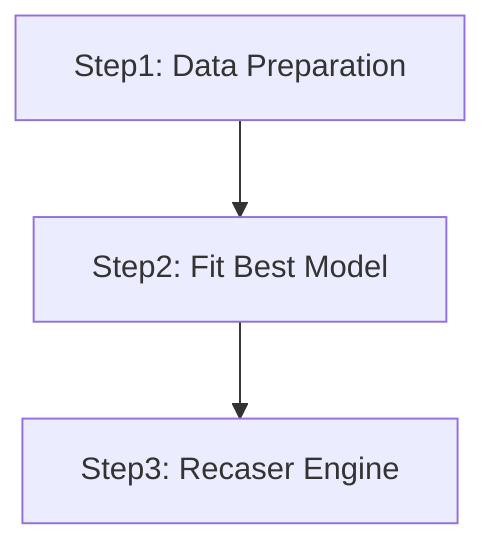
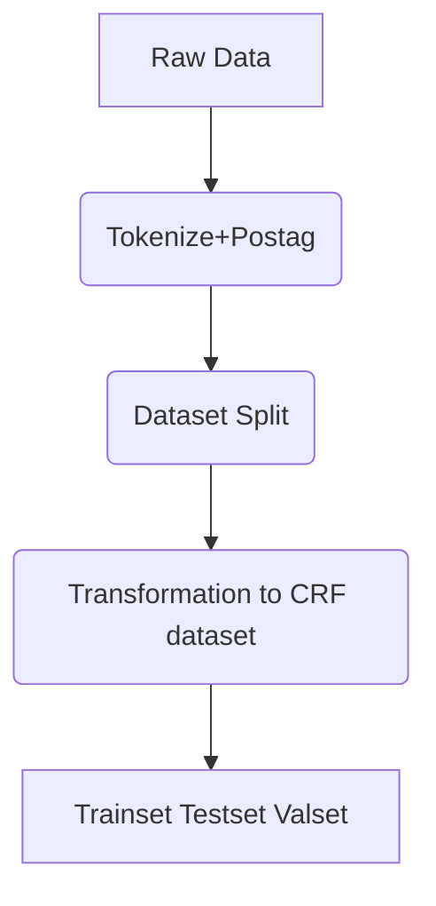
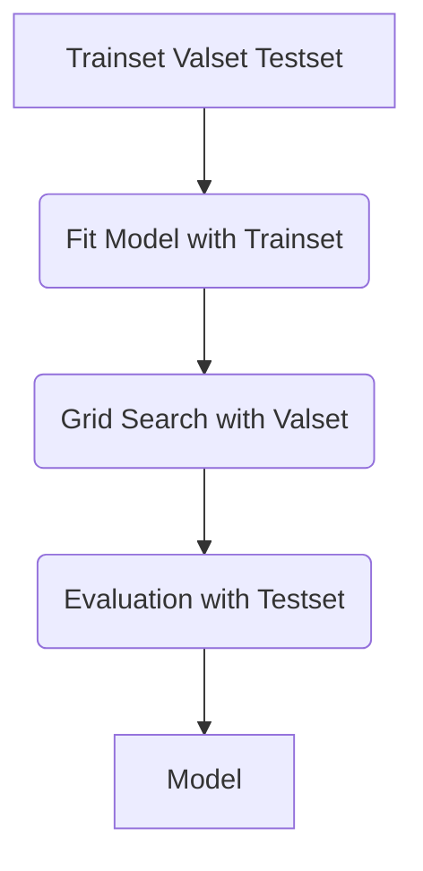

# WordRecaser
WordRecaser based on CRF

## 1. Environment:
```
Python 2.7
pip install pyvi
pip install json
pip install sklearn
```
In terminal for setting up environment:
```
cd recaser/vietnamese
source data/venv_viet_dzm/bin/activate
```

## 2. Project Objective:
### 2.1 Dataset Description:
Raw data consist of sentences for each line
```
Tổng thống Hoa Kỳ Joe Biden yêu cầu Quốc hội thông qua 33 tỷ USD để hỗ trợ Ukraine "trong 5 tháng tới".
Ông nói Mỹ không thể "khoanh tay đứng nhìn" cuộc xâm lược - nhưng khẳng định rằng đất nước của ông không "tấn công" Nga.
Nhà Trắng hôm thứ Năm cũng đề xuất tạo điều kiện thuận lợi hơn cho Mỹ trong việc thu giữ và bán tài sản của các nhà tài phiệt Nga, đồng thời chuyển số tiền thu được cho Ukraine.
...
```
### 2.2 Purpose:
Train a CRF model to automatically recase the text data without any casing.

## 3. Main Project Files:

| File Directory                              | File Attribute                                |
| ------------------------------------------- | ----------------------------------------------|
| /data/all_data.tok.vi                       | All Raw Data                                  |
| /data/train.crf                             | Trainset after data split                     |
| /data/val.crf                               | Validation set after data split               |
| /data/test.crf                              | Testset after data split                      |
| /data/all_train.crf                         | All Raw Data regarded as trainset             |
| /data/mix_dict.json                         | Mix case of train.crf                         |
| /data/low_dict.json                         | Low case of train.crf                         |
| /data/up_dict.json                          | Up case of train.crf                          |
| /data/all_mix_dict.json                     | All the mix case word collection              |
| /train_val_test_split.py                    | Pre-process + Dataset split                   |
| /all_data_aplit.py                          | Pre-process                                   |
| /evaluation.py                              | Evalution of test result                      |
| /gridsearch.py                              | Gridsearch for the best parameter settings    |
| /run.sh  Or /run_V2.sh                      | Execute the recaser engine                    |
| /model                                      | All training models                           |
| /evaluation_result                          | Evaluation result corresponding to each model |

## 4. Project Structure:


### 4.1 Step1: train_val_test_split.py


CRF dataset (right is an example of sentence: "I am fine"):
```
token1  postag1 label1            i     Np      U1
token2  postag2 label2            am    V       O
token3  postag3 label3            fine  Adj     O
```

Apart from trainset, valset and testset, a template file is also required for model fitting process:
```
U00:%x[0,0]
U01:%x[0,1]
U02:%x[0,0]/%x[0,1]
```

The %x[a, b] corresponds to the specific element in CRF dataset:
```
token1(%x[0,0])  postag1(%x[1,0]) label1
token2(%x[0,1])  postag2(%x[1,1]) label2
token3(%x[0,2])  postag3(%x[1,2]) label3
```

Execution Line:
```
cat data/all_data.tok.vi | python2 train_val_test_split.py
```
```
cat data/all_data.tok.vi | python2 all_data_split.py
```

### 4.2 Step2: gridsearch.py | evaluation.py


Fit Model Execution Line:
```
./crf-i2r train template data/train.crf model/MODEL_NAME
```
```
./crf-i2r train template data/all_train.crf model/MODEL_NAME
```

Grid Search Execution Line:
```
python2 gridsearch.py
```

Evaluation Execution Line:
```
./crf-i2r test -m data/test.crf model/MODEL_NAME > data/test_result.crf
python2 evaluation.py
```


